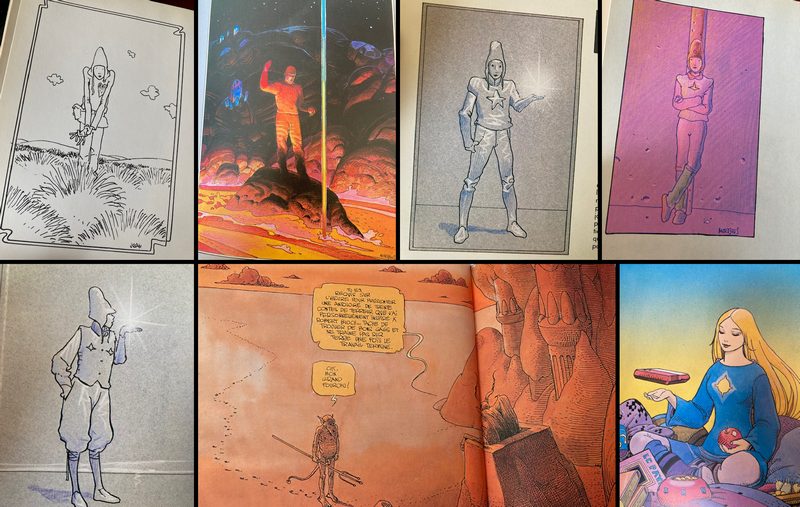
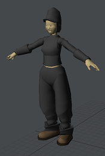
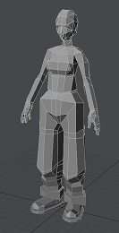
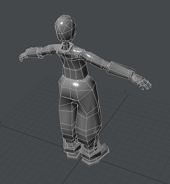
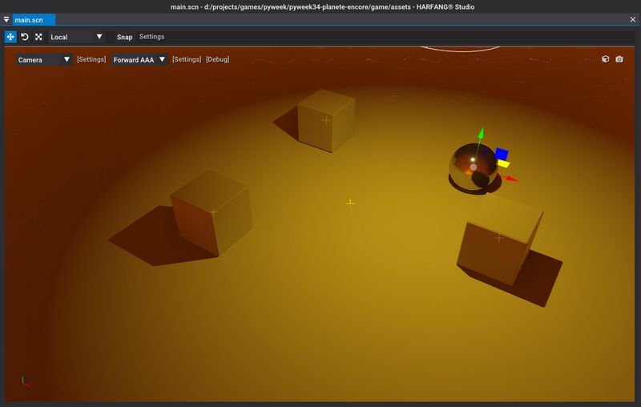
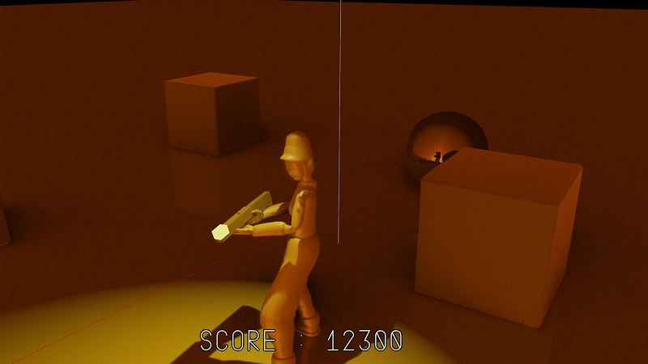

# PyWeek34: Planete Encore

## Game entry for the PyWeek 34

Game prototype for the [PyWeek 34](https://pyweek.org/) game jam. Made with [HARFANG 3D](https://www.harfang3d.com). 
Tribute to Jean `Moebius` Giraud. 
_Planete Encore_ is implemented in [Python](https://www.python.org/) :snake: 

The theme of PyWeek 34 was `Red Planet`, a very inspiring theme that almost quickly directed me toward the universe of Jean `Moebius` Giraud, the French genius of fantasy & sci-fo graphic novels:

I tried to recreate its iconic character with a long hat.

   

The rendering of the game relies on HARFANG's `AAA` 3D pipeline, able to render GI & reflections in screen space on a non-RTX GPU.

_unfinished project_ (again )

See the [devlog here](https://pyweek.org/e/planete-encore/)

## Graphics / Video log

* [Initial gameplay sketch](img/2022-09-04_133733.png)
* https://www.youtube.com/watch?v=y3jie2DZAaM
* https://www.youtube.com/watch?v=_g5AXtmbEDw
* https://www.youtube.com/watch?v=FHWeZc8icQc
* https://www.youtube.com/watch?v=k-UlUHLCHCU
